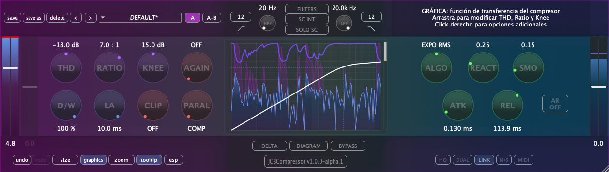

Plugin compresor de audio desarrollado con [gen~ Plugin Export (Cycling '74)](https://cycling74.com) y el framework C++ [JUCE](https://github.com/juce-framework/JUCE). Este plugin es parte de un paquete de plugins de audio básicos hechos con gen~ en Max, y que uso como material didáctico en mis clases de la asignatura de Técnicas de Grabación y Masterización para Música Electroacústica en el [MCE](https://katarinagurska.com/curso-of/master-de-composicion-electroacustica-mce/). Este proyecto en su estadio básico se hizo con JUCE 6 hace unos años pero ha sido mejorado en la parte gráfica y de funcioanlidad mediante el uso de vibe coding con Claude Code en junio de 2025, ver NOTAS.md.

## Instalación macOS
1. Descarga el archivo DMG desde la página de [Releases](https://github.com/cjitter/JCBComp/releases)
2. Abre el DMG y ejecuta el instalador
3. El instalador colocará automáticamente los plugins en las ubicaciones correctas:
   - VST3: `/Library/Audio/Plug-Ins/VST3/`
   - AU: `/Library/Audio/Plug-Ins/Components/`
   - AAX: `/Library/Application Support/Avid/Audio/Plug-Ins/`

*Nota: El DMG está firmado y notarizado para macOS.*

## Requisitos del sistema

- macOS 10.13 o posterior
- Procesador Intel o Apple Silicon
- DAW compatible con VST3, AU o AAX
- Probado en: Pro Tools, Reaper, Logic, Ableton Live y Bitwig

## Compilación desde código fuente

### Requisitos previos
- Git, [CMake](https://cmake.org) 3.20 o posterior, compilador Apple Clang compatible con C++20 (incluido en Xcode 13 o superior).
- [JUCE](https://github.com/juce-framework/JUCE) 8.0.8 (se descarga automáticamente via FetchContent)
- **AAX SDK**, solo requerido para compilar formato AAX - disponible desde cuenta de desarrollador Avid, etc.

### Instrucciones de compilación

1. Clona el repositorio:
```bash
git clone https://github.com/cjitter/JCBCompressor.git
cd JCBCompressor
```

2. **Configuración del proyecto**: El archivo `CMakeLists.txt` es el generador principal del proyecto y define toda la estructura de compilación.

3. **Compilación**:
```bash
# Compilación Debug
cmake -B build-debug -DCMAKE_BUILD_TYPE=Debug
cmake --build build-debug

# Compilación Release
cmake -B build-release -DCMAKE_BUILD_TYPE=Release
cmake --build build-release
```

## Estructura del proyecto

```
JCBCompressor/
├── Assets/                         # Recursos gráficos, código GenExpr y presets
├── Source/                         # Código fuente C++
│   ├── PluginProcessor.cpp/.h      # Procesador principal del plugin
│   ├── PluginEditor.cpp/.h         # Editor principal del plugin
│   ├── Components/                 # Componentes de interfaz
│   │   ├── UI/                     # Componentes de UI personalizados
│   │   │   ├── CustomComboBox.*
│   │   │   ├── CustomSlider.*
│   │   │   ├── CustomTooltip.*
│   │   │   ├── GradientMeter.*
│   │   │   ├── TransferFunctionDisplay.*
│   │   │   └── TriSlider.*
│   │   └── Windows/               # Ventanas auxiliares
│   │       ├── CodeWindow.*
│   │       ├── CreditsWindow.*
│   │       ├── CustomDialog.*
│   │       ├── DarkThemeColors.*
│   │       └── UndoableParameterAttachment.*
│   └── Helpers/                   # Clases de utilidad
│       ├── ParameterChangeAction.*
│       ├── UndoableParameter.*
│       └── UTF8Helper.*
├── exported-code/                # Código Gen~ exportado (auto-generado)
│   └── gen_dsp/                  # Archivos DSP de Gen~
├── Max/                          # Patch original de Max/MSP
│   └── JCBCompressor.maxpat
├── cmake/                       # Configuración CMake para pluginval
├── CMakeLists.txt               # Archivo principal de configuración
├── LICENSE                      # Licencia GPL v3
└── README.md                    # Readme
```

## Características

- **Ajuste de nivel de entrada** en las dos cadenas, trim +-12 dB
- **Procesamiento sidechain interno y externo** con filtros dedicados paso alto y paso bajo
- **Filtros Butterworth de 2º y 4º orden** para las cadenas principal y/o externa
- **Tres modos de detección**: sharp (sliding RMS), expo RMS y slow RMS
- **Ajusto independiente de reacción** entre pico y RMS
- **Control adicional de suavizado** para ajuste fino de la envolvente detectada
- **Compresión con softknee lineal primer orden**
- **Procesamiento estéreo en modo estéreo Link**
- **Controles estándar**: threshold, ratio, knee, attack, release, auto-Release...
- **Softclipping** asimétrico mediante control adicional
- **Visualización** con display de forma de onda y medidores
- **Menú de presets**, usuario y fábrica
- **Bypass interno** independiente del DAW
- **Monitorización delta** (diferencia entrada/salida) y solo de filtros sidechain
- **Formatos soportados**: VST3, AU y AAX

## Uso

### Operación Básica
- **Trim input**: Ganancia de ajuste de entrada (-12 +12 dB)
- **Threshold**: Establece el nivel a partir de done comienza la compresión (-60 a 0 dB)
- **Ratio**: Ajusta la cantidad de compresión (1:1 a 20:1)
- **Attack**: Controla qué tan rápido actúa la compresión (0.1 a 250 ms)
- **Release**: Define qué tan rápido se libera la compresión (0.1 a 1000 ms)
- **Knee**: Ajusta la transición hacia la compresión (0 a 30 dB)
- **Makeup gain**: Ganancia de compensación (funciona junto a auto gain) para recuperar el nivel reducido (-12 +12 dB)
- **Modos de detección**:
  - Sharp (sliding RMS), Expo RMS (normal) y Slow RMS
  - Interpolación continua entre detección rápida y promediada
  - Control de suavizado adicional para personalizar la respuesta
- **Compresión con softknee**: cálculo de reducción con softknee lineal primer orden
- **Sidechain externo**: activa el uso de señal externa para la detección de compresión
- **Filtros**: Butterworth de 2º/4º orden para compresión dependiente de frecuencia
- **Auto gain**: hasta el 70% recuperación de ganancia, funciona junto a makeup gain
- **Compresión paralela**: sumatorio señal seca entrada con señal comprimida
- **Softclipping**: softclipping después de auto gain, makeup gain y compresión paralela
- **Dry/Wet**: mezcla lineal de amplitud entre señal de entrada y salida post softclip (-6 dB a 50%)
- **Bypass interno**: Independiente del bypass del DAW
- **Monitorización**: delta, escucha solo la diferencia entre entrada/salida, y escucha solo de filtros

## Licencia

JCBCompressor es software libre: puedes redistribuirlo y/o modificarlo bajo los términos de la Licencia Pública General GNU publicada por la Free Software Foundation, ya sea la versión 3 de la Licencia, o (a tu elección) cualquier versión posterior. Consulta [LICENSE](LICENSE) para más detalles.

## Recursos

### Bibliografía técnica
- [Graham Wakefield & Gregory Taylor - *Generating Sound and Organizing Time*](https://cycling74.com/books/go)
- [Will C. Pirkle - *Designing Audio Effect Plugins in C++*](https://www.willpirkle.com)
- [Giannoulis, Massberg, Reiss - *Dynamic Range Compressor Design*](https://eecs.qmul.ac.uk/~josh/documents/2012/GiannoulisMassbergReiss-dynamicrangecompression-JAES2012.pdf)
- [Matthijs Hollemans - *The Complete Beginner's Guide to Audio Plug-in Development*](https://www.theaudioprogrammer.com/books/beginners-plugin-book)

## Por hacer

- Migrar de Plugin Export a la exportación C++ de RNBO
- Implementar oversampling con el módulo dsp de JUCE.
- Implementar modos dual y M/S
- Implementar mapeo MIDI
- Mejorar sistema de visualización entrada/salida e histograma de reducción de ganancia

## Enlaces

- **Repositorio GitHub**: [JCBCompressor](https://github.com/cjitter/JCBCompressor)
- **Documentación**: Ver [NOTAS.md](NOTAS.md) para información técnica adicional

---

*JCBCompressor v0.9.99 beta*