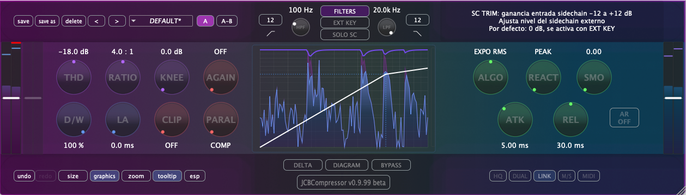

# JCBCompressor



Plugin compresor de audio desarrollado con Gen~ Plugin Export (Cycling '74) y el framework C++ JUCE. Este plugin es parte de un paquete de plugins de audio básicos hechos con Gen~ y usados en las clases de Técnicas de Grabación y Masterización para Música Electroacústica de los másteres [MCE](https://katarinagurska.com/curso-of/master-de-composicion-electroacustica-mce/) y [MCAV](https://katarinagurska.com/curso-of/master-composicion-medios-audiovisuales-mcav/).

## Características

- **Compresión con DSP Gen~** de Max/MSP
- **Procesamiento estéreo en modo Link**
- **Tres modos de detección**: Sliding RMS, Exponential RMS y Slow RMS
- **Interpolación continua** entre detección de pico y RMS
- **Control de suavizado adicional** (smoothing) para ajuste fino de la respuesta
- **Filtros Butterworth de 2º y 4º orden** para las cadenas principal y sidechain
- **Controles estándar**: Threshold, Ratio, Knee, Attack, Release, Auto-Release y más
- **Soft clipping** integrado
- **Procesamiento sidechain** con filtros dedicados
- **Visualización** con display de forma de onda y medidores
- **Menú de presets**
- **Bypass interno** independiente del DAW
- **Monitorización delta** (diferencia entrada/salida), solo de filtros sidechain
- **Formatos soportados**: VST3, AU y AAX

## Requisitos del Sistema

### macOS
- macOS 10.13 o posterior
- Procesador Intel o Apple Silicon
- DAW compatible con VST3, AU o AAX
- Probado en: Pro Tools, Reaper, Logic, Ableton Live y Bitwig

## Instalación

### macOS
1. Descarga el archivo DMG desde la página de [Releases](https://github.com/cjitter/JCBComp/releases)
2. Abre el DMG y ejecuta el instalador
3. El instalador colocará automáticamente los plugins en las ubicaciones correctas:
   - VST3: `/Library/Audio/Plug-Ins/VST3/`
   - AU: `/Library/Audio/Plug-Ins/Components/`
   - AAX: `/Library/Application Support/Avid/Audio/Plug-Ins/`

*Nota: El DMG está firmado y notarizado para macOS.*

## Compilación desde Código Fuente

### Requisitos Previos
- CMake 3.20 o posterior
- Compilador compatible con C++20
- Git
- Generador Ninja (para mejor compatibilidad)
- JUCE 8.0.8 (se descarga automáticamente via FetchContent)
- **AAX SDK** (requerido para compilar formato AAX - disponible desde cuenta de desarrollador Avid)

### Instrucciones de Compilación

1. Clona el repositorio:
```bash
git clone https://github.com/cjitter/JCBCompressor.git
cd JCBCompressor
```

2. **Configuración del proyecto**: El archivo `CMakeLists.txt` es el generador principal del proyecto y define toda la estructura de compilación.

3. **Compilación**:
```bash
# Compilación Debug
cmake -B cmake-build-debug -G Ninja -DCMAKE_BUILD_TYPE=Debug
cmake --build cmake-build-debug

# Compilación Release
cmake -B cmake-build-release -G Ninja -DCMAKE_BUILD_TYPE=Release
cmake --build cmake-build-release
```

### Notas Importantes de Compilación
- El directorio `exported-code/` contiene código Gen~ auto-generado - no modificar
- Usa directorios de compilación separados para cualquier experimento con cmake

## Estructura del Proyecto

```
JCBCompressor/
├── Assets/                 # Imágenes, presets, código Gen~
│   ├── FactoryPresets/    # Presets incluidos
│   └── code/              # Código fuente Gen~
├── Source/                # Código fuente C++
│   ├── Components/        # Componentes UI
│   │   ├── Core/         # Componentes base
│   │   ├── Controls/     # Knobs, botones, etc.
│   │   ├── Display/      # Componentes de visualización
│   │   └── Windows/      # Ventanas emergentes
│   ├── Helpers/          # Clases de utilidad
│   └── Plugin*.cpp/h     # Archivos principales del plugin
├── Max/                   # Patches de Max/MSP
├── exported-code/         # Código exportado de Gen~ (auto-generado)
└── cmake-build-*/         # Directorios de compilación (gestionados por CLion)
```

## Uso

### Operación Básica
1. **Threshold**: Establece el nivel al que comienza la compresión (-60 a 0 dB)
2. **Ratio**: Ajusta la cantidad de compresión (1:1 a 100:1)
3. **Attack**: Controla qué tan rápido actúa la compresión (0.0 a 30.0 ms)
4. **Release**: Define qué tan rápido se libera la compresión (5.0 a 1000.0 ms)
5. **Knee**: Ajusta la transición hacia la compresión (0.0 a 20.0 dB)
6. **Gain**: Ganancia de compensación para recuperar el nivel reducido

### Características Adicionales
- **Sidechain**: Usa una señal externa para la detección de compresión
- **Filtros**: Butterworth de 2º y 4º orden para compresión dependiente de frecuencia
- **Modos de Detección**: 
  - Sliding RMS, Exponential RMS y Slow RMS
  - Interpolación continua entre detección de pico y RMS
  - Control de smoothing adicional para personalizar la respuesta
- **Compresión Paralela**: Mezcla las señales comprimida y seca
- **Bypass interno**: Independiente del bypass del DAW
- **Monitoreo Delta**: Escucha solo la diferencia entre entrada y salida
- **Monitoreo Solo de Filtros Sidechain**: Escucha aislada de la cadena sidechain filtrada

## Licencia

JCBCompressor es software libre: puedes redistribuirlo y/o modificarlo bajo los términos de la Licencia Pública General GNU publicada por la Free Software Foundation, ya sea la versión 3 de la Licencia, o (a tu elección) cualquier versión posterior.

Consulta [LICENSE](LICENSE) para más detalles.

## Por Hacer

- Migrar de Plugin Export a la exportación C++ de RNBO
- Implementar oversampling
- Implementar modo dual y M/S
- Implementar MIDI mapping
- Mejorar sistema de visualización entrada/salida e histograma de reducción de ganancia

## Enlaces

- **Repositorio GitHub**: [https://github.com/cjitter/JCBCompressor](https://github.com/cjitter/JCBCompressor)
- **Documentación**: Ver [NOTAS.md](NOTAS.md) para información adicional

---

*JCBCompressor v0.9.99 beta - Un plugin compresor de código abierto con Gen~ en su corazón*