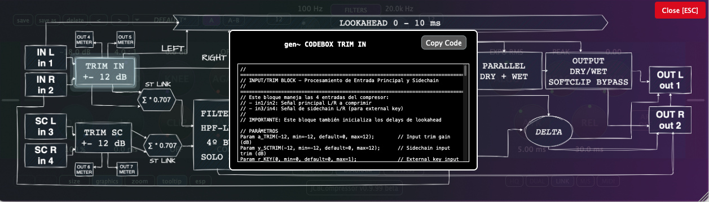

Plugin compresor de audio desarrollado con [gen~ Plugin Export](https://github.com/Cycling74/gen-plugin-export) y el framework C++ [JUCE](https://github.com/juce-framework/JUCE). Este plugin forma parte de un conjunto de herramientas didácticas que utilizo en la asignatura de Técnicas de Grabación y Masterización para Música Electroacústica del [MCE](https://katarinagurska.com/curso-of/master-de-composicion-electroacustica-mce/). Originalmente creado con JUCE 6 hace unos años, el proyecto ha evolucionado significativamente en su interfaz gráfica y funcionalidad gracias al desarrollo colaborativo con Claude Code durante junio de 2025. Para más detalles técnicos, consulta [NOTAS.md](NOTAS.md).

## Instalación macOS
1. Descarga el archivo DMG desde la página de [Releases](https://github.com/cjitter/JCBCompressor/releases)
2. Abre el DMG y ejecuta el instalador
3. El instalador colocará automáticamente los tipos de plugins seleccionados en las ubicaciones correctas del sistema:
   - VST3: `/Library/Audio/Plug-Ins/VST3/`
   - AU: `/Library/Audio/Plug-Ins/Components/`
   - AAX: `/Library/Application Support/Avid/Audio/Plug-Ins/`

*Nota: El DMG está firmado y notarizado para macOS.*

## Requisitos del sistema

- macOS 10.13 o posterior
- Procesador Intel o Apple Silicon
- DAW compatible con VST3, AU o AAX
- Probado en: Pro Tools, Reaper, Logic, Ableton Live y Bitwig

## Compilación desde código fuente

### Requisitos previos
- Git, [CMake](https://cmake.org) 3.20 o posterior, compilador Apple Clang compatible con C++20 (incluido en Xcode 13 o superior).
- [JUCE](https://github.com/juce-framework/JUCE) 8.0.8 (se descarga automáticamente via FetchContent)
- **AAX SDK**, solo requerido para compilar formato AAX - disponible desde cuenta de desarrollador Avid, etc.

### Instrucciones de compilación

1. Clona el repositorio:
```bash
git clone https://github.com/cjitter/JCBCompressor.git
cd JCBCompressor
```

2. **Configuración del proyecto**:
```bash
# Configurar proyecto Debug (VST3 y AU)
cmake -B build-debug -DCMAKE_BUILD_TYPE=Debug

# Configurar proyecto Release (VST3 y AU)
cmake -B build-release -DCMAKE_BUILD_TYPE=Release

# Configurar proyecto Release con AAX (requiere AAX SDK y Pro Tools Developer instalado)
cmake -B build-release -DCMAKE_BUILD_TYPE=Release -DJUCE_BUILD_AAX=ON
```

3. **Compilación**:
```bash
# Compilar el proyecto configurado
cmake --build build-debug    # Para Debug
cmake --build build-release   # Para Release
```

**Nota sobre AAX**: Si configuras con la opción AAX habilitada, el plugin se instalará automáticamente en `/Applications/Pro Tools Developer/Plug-Ins/` para testing con Pro Tools Developer.

## Características principales

- **Ajuste de entrada** (trim ±12 dB) para ambas cadenas.
- **Procesamiento sidechain** interno y externo con filtros paso alto y bajo, 2º/4º orden.
- **Tres modos de detección**: sharp (sliding RMS), expo RMS y slow RMS, con interpolación continua y control adicional de suavizado.
- **Ajuste independiente de reacción pico/RMS**.
- **Compresión con softknee** lineal de primer orden.
- **Controles estándar**: threshold (-60 a 0 dB), ratio (1:1 a 20:1), attack (0.1 a 250 ms), release (0.1 a 1000 ms), knee (0 a 30 dB).
- **Ganancia de compensación** (makeup gain ±12 dB) y **auto gain** (hasta 70% de recuperación).
- **Compresión paralela** mediante suma 100% señal seca/comprimida.
- **Softclipping asimétrico**, aplicado tras compresión y makeup gain.
- **Control Dry/Wet** (-6 dB a 50%) para mezcla de señal post-procesado (post softclip).
- **Procesamiento estéreo** con opción estéreo link.
- **Monitorización avanzada**: escucha delta (entrada/salida) y solo sidechain.
- **Visualización gráfica**: forma de onda, medidores y reducción de ganancia.
- **Gestión de presets** (usuario y fábrica).
- **Bypass interno**, independiente del DAW.
- **Formatos disponibles**: VST3, AU y AAX.
- **Visualización del diagrama de bloques**: Acceso al diagrama completo del compresor con posibilidad de explorar cada bloque y copiar el código GenExpr para usar directamente en objetos Codebox o gen.codebox~ (Max 9).



## Recursos

### Bibliografía técnica
- [Graham Wakefield & Gregory Taylor - *Generating Sound and Organizing Time*](https://cycling74.com/books/go)
- [Will C. Pirkle - *Designing Audio Effect Plugins in C++*](https://www.willpirkle.com)
- [Giannoulis, Massberg, Reiss - *Dynamic Range Compressor Design*](https://eecs.qmul.ac.uk/~josh/documents/2012/GiannoulisMassbergReiss-dynamicrangecompression-JAES2012.pdf)
- [Matthijs Hollemans - *The Complete Beginner's Guide to Audio Plug-in Development*](https://www.theaudioprogrammer.com/books/beginners-plugin-book)

## Testing con pluginval

Este proyecto incluye tests automáticos con [pluginval](https://github.com/Tracktion/pluginval) para validar el plugin.

### Configuración

- **Detección automática**: Si tienes pluginval instalado, CMake lo detectará automáticamente
- **Descarga automática**: Si no está instalado, se descargará automáticamente en la carpeta `tools/`
- Para desactivar la descarga automática:
  ```bash
  cmake -B build -DPLUGINVAL_AUTO_DOWNLOAD=OFF
  ```

### Ejecutar los tests

```bash
# Entra al directorio de build (el mismo nombre que usaste después de -B al configurar)
# Por ejemplo: si usaste "cmake -B build", entonces:
cd build

# Ejecutar todos los tests de pluginval con salida detallada
# Usa -C Release o -C Debug según cómo compilaste el plugin
# Nota: Los tests completos pueden tardar varios minutos
ctest -C Release -R pluginval -V
```

Los tests validan los formatos VST3 y AU del plugin.

## Por hacer

- Migrar de Plugin Export a la exportación C++ de RNBO.
- Implementar oversampling con el módulo dsp de JUCE.
- Implementar modos dual y M/S.
- Implementar mapeo MIDI.
- Mejorar sistema de visualización entrada/salida e histograma de reducción de ganancia.

---

*JCBCompressor v0.9.99 beta*