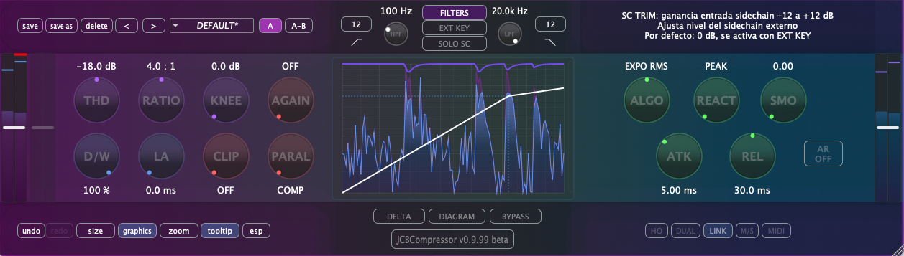

# JCBCompressor



A professional VST3/AU/AAX compressor plugin featuring a Gen~ (Max/MSP) DSP engine with advanced sidechain capabilities and real-time visual feedback.

## Features

- **High-quality compression** with Gen~ DSP engine from Max/MSP
- **Advanced sidechain** processing with dedicated filters
- **Real-time visualization** including waveform display and gain reduction meters
- **Flexible routing** with stereo and mid/side processing
- **Multiple detection modes**: RMS, Peak, and Exponential RMS
- **Comprehensive filtering**: HP/LP filters for both main and sidechain paths
- **Professional controls**: Threshold, Ratio, Knee, Attack, Release, and more
- **Factory presets** for quick starting points
- **Cross-platform**: macOS (VST3, AU) and Windows (VST3), Pro Tools (AAX)

## System Requirements

### macOS
- macOS 10.13 or later
- Intel or Apple Silicon processor
- VST3, AU, or AAX compatible DAW

### Windows
- Windows 10 or later
- 64-bit processor
- VST3 or AAX compatible DAW

## Installation

### macOS
1. Download the latest release from the [Releases](https://github.com/cjitter/JCBComp/releases) page
2. Open the DMG file
3. Copy the plugin to your desired location:
   - VST3: `/Library/Audio/Plug-Ins/VST3/`
   - AU: `/Library/Audio/Plug-Ins/Components/`
   - AAX: `/Library/Application Support/Avid/Audio/Plug-Ins/`

### Windows
1. Download the latest release installer
2. Run the installer and follow the instructions
3. Default installation paths:
   - VST3: `C:\Program Files\Common Files\VST3\`
   - AAX: `C:\Program Files\Common Files\Avid\Audio\Plug-Ins\`

## Building from Source

### Prerequisites
- CMake 3.20 or later
- C++20 compatible compiler
- Git
- **CLion** (recommended) with Ninja generator
- JUCE 8.0.8 (included as git submodule)
- AAX SDK (optional, for Pro Tools support)

### Build Instructions

1. Clone the repository with submodules:
```bash
git clone --recursive https://github.com/cjitter/JCBComp.git
cd JCBComp
```

2. **Using CLion (Recommended)**:
   - Open the project in CLion
   - CLion will automatically configure with Ninja
   - Build using CLion's build configurations

3. **Command Line Build**:
```bash
# Debug build
cmake -B cmake-build-debug -G Ninja -DCMAKE_BUILD_TYPE=Debug
cmake --build cmake-build-debug

# Release build
cmake -B cmake-build-release -G Ninja -DCMAKE_BUILD_TYPE=Release
cmake --build cmake-build-release
```

4. **Code Signing (macOS)**:
```bash
./build-xcode-vst3-au-release.sh    # For VST3/AU
./build-xcode-aax-release.sh         # For AAX
```

### Important Build Notes
- **Never run cmake without `-G Ninja`** flag to avoid contaminating CLion directories
- The `exported-code/` directory contains auto-generated Gen~ code - do not modify
- Use separate build directories for any cmake experiments

## Project Structure

```
JCBCompressor/
├── Assets/                 # Images, presets, Gen~ code
│   ├── FactoryPresets/    # Built-in presets
│   └── code/              # Gen~ source code
├── Source/                # C++ source code
│   ├── Components/        # UI components
│   │   ├── Core/         # Foundation components
│   │   ├── Controls/     # Knobs, buttons, etc.
│   │   ├── Display/      # Visualization components
│   │   └── Windows/      # Popup windows
│   ├── Helpers/          # Utility classes
│   └── Plugin*.cpp/h     # Main plugin files
├── Max/                   # Max/MSP patches
├── exported-code/         # Gen~ exported code (auto-generated)
└── cmake-build-*/         # Build directories (CLion managed)
```

## Usage

### Basic Operation
1. **Threshold**: Set the level at which compression begins (-60 to 0 dB)
2. **Ratio**: Adjust compression amount (1:1 to 100:1)
3. **Attack**: Control how quickly compression engages (0.0 to 30.0 ms)
4. **Release**: Set how quickly compression releases (5.0 to 1000.0 ms)
5. **Knee**: Adjust the transition into compression (0.0 to 20.0 dB)
6. **Gain**: Makeup gain to compensate for level reduction

### Advanced Features
- **Sidechain**: Use external signal for compression detection
- **Filters**: HP/LP filters for frequency-selective compression
- **Detection Modes**: Choose between RMS, Peak, or Exponential RMS
- **Parallel Compression**: Blend compressed and dry signals
- **Mid/Side Processing**: Process mid and side signals independently

## Development Workflow

1. **Always plan changes first** - Read relevant files and propose modifications
2. **Make targeted changes** - Avoid large-scale modifications without approval
3. **Test thoroughly** - Compile → Test in DAW → Iterate
4. **Document changes** - Explain modifications and suggest git commits
5. **Respect the Gen~ boundary** - Never modify `exported-code/` directory

## License

JCBCompressor is free software: you can redistribute it and/or modify it under the terms of the GNU General Public License as published by the Free Software Foundation, either version 3 of the License, or (at your option) any later version.

See [LICENSE](LICENSE) for details.

## Credits

- **Author**: Juan Carlos Blancas
- **DSP Engine**: Gen~ (Cycling '74 Max/MSP)
- **Framework**: JUCE
- **Special Thanks**: To the open-source audio community

## Links

- **GitHub Repository**: [https://github.com/cjitter/JCBComp](https://github.com/cjitter/JCBComp)
- **Documentation**: See `zEstudio/` folder for detailed development docs
- **Issues**: [Report bugs or request features](https://github.com/cjitter/JCBComp/issues)

## Contributing

This is an educational open-source project. Contributions are welcome! Please:
1. Fork the repository
2. Create a feature branch
3. Make your changes following the development workflow
4. Submit a pull request

---

*JCBCompressor v0.9.99 beta - A professional compressor with Gen~ at its heart*